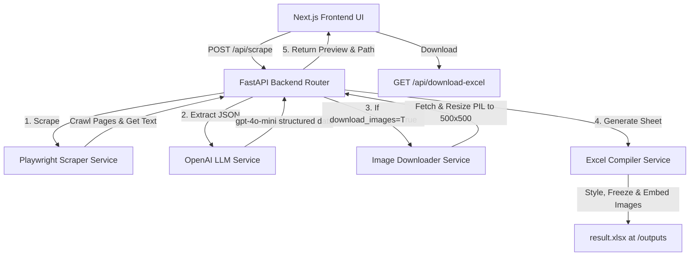

# Web Scraper AI Agent - Complete Architecture & Flow Guide

Welcome to the **Web Scraper AI Agent** guide. This document explains the complete architectural design, backend services, frontend dashboard, step-by-step execution flow, and how we solved the Windows-specific Playwright/asyncio issues.

---

## 🏗️ Architecture Overview

The system is built as a highly coordinated full-stack application:



---

## 📂 Detailed File Breakdown & Roles

### 1. `backend/main.py` (App Entry Point)
- **Windows asyncio Fix**: Sabse top par Windows OS ke liye `WindowsProactorEventLoopPolicy` configure kiya hai. Windows default loop (`SelectorEventLoop`) me Playwright ke subprocesses block ho jate hain aur `NotImplementedError` dete hain. Proactor loop ise fix karta hai.
- **Static Assets**: `/backend/outputs` directory ko statically serve karta hai `/outputs` url par, jisse frontend dynamic images aur result sheets ko directly web-url se access kar sake.
- **CORS Setup**: Dashboard interaction ke liye `localhost:3000` (Next.js) ko full access settings allow karta hai.

### 2. `backend/routes/scraper_routes.py` (The Orchestrator Router)
- **`POST /api/scrape`**: Master routing API. Ye sequentially pure scraper process ko coordinate karta hai:
  1. Playwright se target URL (aur dynamic pagination pages) ka raw text crawl karta hai.
  2. Raw text ko clean karke target specifications ke sath `gpt-4o-mini` model me bhejkar clean structured JSON arrays extract karta hai.
  3. Agar images trigger active hai, to product images link ko download aur compress karta hai aur rows se index-map karta hai.
  4. Extracted lists aur image files ko standard professional styling ke sath Excel sheet `/outputs/result.xlsx` me convert karta hai.
  5. JSON formatted preview data (first 5 records) aur download path frontend ko return karta hai.
- **`GET /api/download-excel`**: Streaming route jo generated Excel file download karwata hai.
- **`GET /api/status`**: System health check validation API.

### 3. `backend/services/scraper.py` (Playwright Engine)
- **Anti-Blocking Configurations**: Browser launches ke sath custom modern `User-Agent` aur request headers pass karta hai, jo anti-bot security systems ko bypass karne me help karte hain.
- **`scrape_website`**: Headless Chromium browser start karke single pages se `page_title`, `meta_description`, `raw_text` (`innerText` only, tags stripped), `all_links`, aur `image_urls` fetch karta hai.
- **`scrape_multiple_pages` (Pagination)**: Page index list compile karta hai. Heuristic algorithms ke through "Next Page" links (matching patterns: `rel="next"`, text variations like `"Next"`, `"Older"`, `">"`, `"→"`, etc.) ko auto-detect karke sequentially maximum target pages tak traverse karta hai. Har request ke bich me `1-3 seconds` ka random delay/sleep dalta hai.

### 4. `backend/services/llm_service.py` (OpenAI Intelligence)
- **Input Truncation (Token Optimization)**: Raw web text se duplicate whitespace hatakar max `12,000 characters` (~3000 tokens) par truncate karta hai. Isse token load aur running bills minimum rehte hain.
- **`extract_structured_data`**: Optimized text ko `gpt-4o-mini` model me strict system instructions ("Output clean JSON only, no markdown") aur user instruction ke sath submit karke schema-parsed objects collect karta hai. Fail hone par empty dict `{}` return karta hai.
- **`analyze_image`**: Encoded base64 images ko `gpt-4o` Vision API me process karke color, condition, aur texts analyze karta hai.
- **`generate_excel_schema`**: Dynamic columns design karne ke liye data keys ka logical structure evaluate karta hai.

### 5. `backend/services/image_downloader.py` (Image Processing)
- **Directory Auto-Creation**: `/backend/outputs/images` folder agar missing ho, to use auto-create karta hai.
- **Image Resizing (Pillow)**: Har standard URL image ko fetch karke, Pillow library ke through dynamic `LANCZOS` compression apply karta hai aur safe bound `500x500 pixels` me lock karta hai.
- **JPEG Formats conversion**: Transparent alpha transparency layers (RGBA/LA/P) ko automatically clear white background par combine karke standard high-quality `JPEG` image form me convert karta hai aur files name `{productname}_{index}.jpg` form me set karta hai.

### 6. `backend/services/excel_service.py` (Excel Engine)
- **Calibri Formatting & Styling**:
  - **Headers**: Calibri, Bold, White font color aur premium dark-blue fill (`#1E40AF`).
  - **Zebra Striping**: Row backgrounds alternate white aur soft-gray (`#F3F4F6`) colors me apply hoti hain.
  - **Borders**: Clean styled borders gridlines binding.
- **Embedded Visuals**: Excel sheets ke last column me "Image" header add karke row lines height to `60pt` (~80px) badhata hai aur Pillow generated target photos ko exactly `80x80px` dimensions ke sath custom cell frames me lock/embed kar deta hai.
- **Panes Freezing**: Top row header ko freeze (`ws.freeze_panes = "A2"`) rakhta hai taki scrolling ke waqt heading locked rahe.
- **Auto Width & Filters**: Sare columns ka text content size evaluate karke dynamic cell width (min 12, max 50) assign karta hai aur sorting filter dropdown arrows toggle karta hai.

### 7. `backend/test_agent.py` (Integration Testing Pipeline)
- **Complete Test Runner**: Ek single integration suite jo standard free books practice site (`https://books.toscrape.com`) se 2 pages target crawl karta hai, columns extract karta hai, 3 books image resizing run karta hai, and spreadsheet compile karke pricing estimation metric print karta hai. 
- Mocks boundaries testing cases ko execute karta hai.

---

## ⚡ Execution Flow: Step-by-Step

Aap jab dashboard par click karte hain to runtime me ye process execute hota hai:

```
[UI Dashboard Form Submit]
         │
         ▼
[POST /api/scrape] -> FastAPI parses inputs
         │
         ▼
[Playwright Crawler] -> Opens Chromium -> Gathers Raw Web Texts -> Follows Next Page (1-3s delays)
         │
         ▼
[LLM Processing] -> Token limits text -> Sends to gpt-4o-mini -> Returns formatted JSON records list
         │
         ▼
[Image Downloader] -> Pulls product img links -> Combines alpha to white background -> Resizes to 500x500 JPEGs
         │
         ▼
[Excel Generation] -> Creates Sheet -> Styles Zebra striping -> Autocalculates column widths -> Embeds 80x80 images
         │
         ▼
[API Response] -> Returns first 5 preview rows + "/api/download-excel" link
         │
         ▼
[UI Dashboard Render] -> Progress Status shows Checked -> Renders Preview Table with Image Thumbnails
         │
         ▼
[User Action] -> Clicks big green Download button -> Saves result.xlsx locally
```

---

## 🛠️ Windows specific event loop bug fix details
Windows OS me, Uvicorn start process me reload config default asyncio selector loop set karta hai, jisse subprocess support block (`raise NotImplementedError`) hota hai. 

Humne `main.py` ke sabse top par ye dynamic override setup lagaya:
```python
import sys
import asyncio

if sys.platform == 'win32':
    asyncio.set_event_loop_policy(asyncio.WindowsProactorEventLoopPolicy())
```
Is configuration ki wajah se Windows system child worker processes launch karne se pehle **`ProactorEventLoop`** instantiate karta hai, jo system subprocess execution ko active rakhta hai, aur Playwright Chromium bina kisi error ke successfully running loop ke andar navigate kar pata hai!

---

## 🐳 Docker Deployment Guide (For Render Hosting)

Docker ka use karne se backend ko **Render** ya kisi bhi cloud provider par deploy karna behad simple aur error-free ho jata hai. Playwright ke browsers chalane ke liye jin system-level libraries (.so files) ki zaroorat hoti hai, wo Docker container me pehle se bundled rehti hain.

### 1. Build and Run locally with Docker
Aap local system par testing ke liye container build aur run kar sakte hain:
```bash
# Backend folder me jayein
cd backend

# Docker Image build karein
docker build -t web-scraper-backend .

# Docker Container run karein
docker run -p 8000:8000 --env-file .env web-scraper-backend
```

### 2. Render Deployment via Docker
Render automatically `Dockerfile` ko detect karke deploy kar deta hai.
1. GitHub repo par commit aur push karein.
2. Render Dashboard me **"New > Web Service"** par click karein.
3. Repository connect karein.
4. Settings me **Runtime** select karein: **`Docker`** (ye auto-detect ho jayega).
5. Environment Variables tab me standard variables add karein:
   - `OPENAI_API_KEY` = `your-key`
   - `BASE_URL` = `your-render-url`
6. Deploy button par click karein. Render pure Playwright container system ko compile karke service active kar dega!

